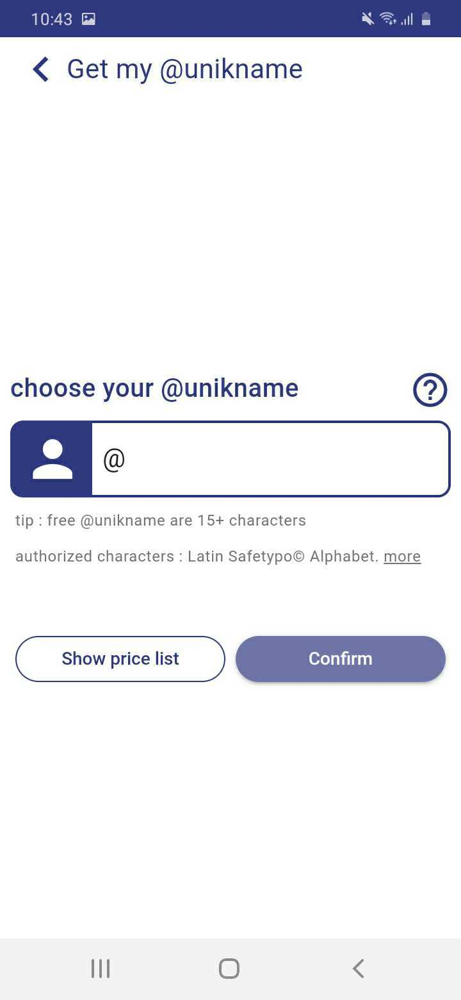
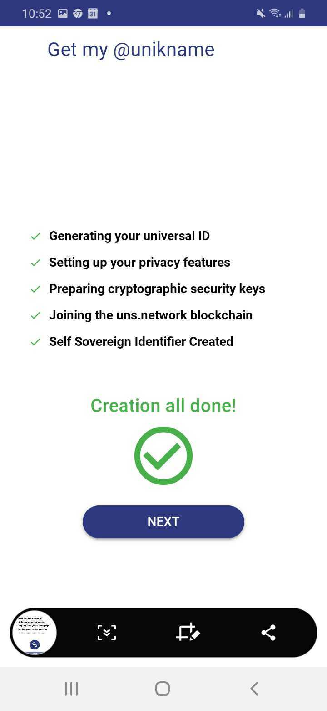

# Unikname DID Specification #


## Author ##

[Unikname Team](https://www.unikname.com/en/equipe-unikname-2/)

From [Space Elephant SAS/France](https://www.spacelephant.org/)

Written by [Sophie Dramé-Maigné](mailto:sophie.dramemaigne@unikname.com)


## Abstract ##

As the world is turning increasingly more digital, there is a growing need for globally unique identifiers. Decentralized Identifiers (DIDs) offer an alternative to traditional solutions relying on central entities to issue and manage such identifiers. DIDs take advantage of decentralized verifiable data registry such as blockchains to enable the decentralization of these processes and give users control over their own online identities. 

Though physical users represent a good portion of DID owners, DID can be used to represent anything: industrial processes, digital assets, physical goods, blockchain tokens, and even identifiers. The `unik` DID method specializes in @unikname, privacy-preserving human-readable identifiers, represented as Non-Fungible Tokens (NFT) on the **uns.network** blockchain. 

This document defines the `unik` DID method in compliance with the W3C's [DID Specification](https://w3c.github.io/did-core/). It describes how unik-specific DID are generated as well as how to manage the corresponding DIDs and resolve them to DID Documents (DDoc). Because they represent identifiers, `unik` DID cannot be their own controller. `unik` DID are build to work with [uns DID](https://github.com/unik-name/did-method-spec/blob/main/did-uns/UNS-DID-Specification.md) as their management requires a **uns.network** cryptoaccount. However, other types of DIDs could be used as controllers in the future.

This DID method has been registered in the [DID Specification Registries](https://w3c.github.io/did-spec-registries/#did-methods).


## Intro ##

The **uns.network** blockchain is dedicated to the management of Non Fungible Tokens (NFT). The first type of NFT that it supports are [@unikname](https://docs.unikname.com/), privacy-preserving human-readable identifiers. Just like any other tokens, @unikname can be bought or exchanged. They can also be linked to public properties their owner wishes to advertise: Addresses for other blockchain accounts, online CV, personal blog, ... @unikname can also be used to [connect to compliant websites](https://www.unikname.com/en/european-alternative-social-signup-gafam/) in a private and secure fashion. The `unik` DID method associates a DID with each of these NFT token.

@unikname are identifiers, not identities. They are labels that exist independently of the thing they are labeling. By default, @unikname tokens are linked to the **uns.network** cryptoaccount that owns them. As identifiers, `unik` DID cannot be their own controllers and rely on `uns` DID, [DID associated with **uns.network** cryptoaccounts](https://github.com/unik-name/did-method-spec/blob/main/did-uns/UNS-DID-Specification.md).  

This specification describes how to create @unikname-associated DID and how to manage them. In particular, it describes how to choose a unikname, verify its availability, and register it. All information contained in DID Documents (DDoc) are extracted from the underlying blockchain. 

To solve a @unikname to a DID and more, Unikname has developed its [own resolver](https://my.unikname.com/).


## Target System ##

The `unik` DID method uses the [**uns.network**](https://docs.uns.network) blockchain as the underlying Verifiable Data Registry. A **uns.network** cryptoaccount is therefore required to create and update DID and DDocs.

**uns.network** is a distributed network and protocol dedicated to handling IDs rooted in the blockchain, aiming to secure any web and mobile connections, and to protect users' privacy. 

**uns.network** is based on [ARK.io](https://ark.io).


### Tools ###

When working with @unikname, there are two preferred tools: a command line tool, and a graphical interface. 


#### Command Line Interface (CLI) ####

**uns.network** provides an interactive [Command Line Interface](https://docs.uns.network/uns-use-the-network/cli.html#download-and-installation) to create and manage @unikname as well as their properties and the cryptoaccount that own them. The rest of this specification will provide examples using the CLI. 


#### My Unikname app ###

The Unikname Team alternatively provides a [mobile application](https://my.unikname.app/app) to manage and use your @unikname. 


## DID Method Name ##

This method is identified by the following string:  `unik`

A DID that uses this method MUST begin with the following prefix: `did:unik:`

The prefix MUST be in lowercase as per the [DID specification](https://www.w3.org/TR/did-core/#did-syntax). The format and generation of method-specific identifiers are defined below.


## Method-specific Identifier ##

A `unik` DID identifies a UNIK, a Non Fungible Token (NFT) from the **uns.network** that represents a human-readable identifier, called a @unikname. As such, this method uses the unik-id, the primary key of said NFT, as its identifier. 

The difference between the three concepts (UNIK, @unikname, and unik-id) is specified in the table below. The terms are used somewhat interchangeably in the reminder of this specification.

| Concept   | Definition                                                   | Example                                                      |
| :-------- | ------------------------------------------------------------ | ------------------------------------------------------------ |
| UNIK      | The NFT                                                      | {<br/>  "data": {<br/>    "id": "158cffbe4d7b567468a17290c0cd1546ea3b013059a3a471e5ad309cfddfb0e3",<br/>    "owner": {<br/>      "address": "UYWaMkArHJjMecuHgs6LYapFtvV27QeafX"<br/>    },<br/>    "creationBlock": "3af261e99286fadf83d35bf39b8a199525e4e535cd91597b23e36d296eb54d3f",<br/>    "creationTransaction": "2c834a17694e55716411da681db38ab233adf71fc6e4028a58728619c70a3031",<br/>    "creationDate": "2020-04-28T04:38:08.000Z",<br/>    "properties": [ ... ]<br/>  }<br/>} |
| @unikname | The human-readable identifier                                | @bob                                                         |
| unik-id   | The primary key of a UNIK. Generated from the associated @unikname. | 158cffbe4d7b567468a17290c0cd1546ea3b013059a3a471e5ad309cfddfb0e3 |

 

A `unik` DID is formated as follows:

```
unik-did = "did:unik:" uns-specific-idstring
unik-specific-idstring = unik-id
unik-id = 64*HEXDIG
```


## Example DID document ##

We provide an example DID document below:

```json
{
    "@context": ["https://www.w3.org/ns/did/v1"],
    "id": "did:unik:158cffbe4d7b567468a17290c0cd1546ea3b013059a3a471e5ad309cfddfb0e3",
    "created": "2020-04-28T04:38:08.000Z",
    "controller": "did:uns:UYWaMkArHJjMecuHgs6LYapFtvV27QeafX",
    "verificationMethod": [
        {
            "id": "did:unik:158cffbe4d7b567468a17290c0cd1546ea3b013059a3a471e5ad309cfddfb0e3#controller",
            "controller": "did:uns:UYWaMkArHJjMecuHgs6LYapFtvV27QeafX",
            "type": "EcdsaSecp256k1VerificationKey2019",
            "publicKeyBase58": "sZny6zsvdwXYJaVQ9HD1XAvUBwC2M3Fqn1GR4rk1QCWJ"
        }
    ], 
	"authentication": ["controller"]
}
```

#### Required/Mandatory fields ####

##### id #####

As per the DID Specification, all DID Document MUST contain an id field.

##### controller #####

A `unik` DID Document MUST include a controller field. This field cannot point to a `unik` DID.

At the moment, `unik` DID only support `uns` DID controllers. This may be extended in the future.

##### verificationMethod #####

A `unik` DID Document MUST include a list of public keys, at least one of which MUST belong to their controller. Such a key is labeled as `#controller`.

This method supports the PublicKeyBase58 format.

##### authentication #####

A `unik` DID Document MUST include an authentication field. The default value for this field is `["controller"]`.


## CRUD Operation Definitions  ##


### Create (Register) ###

The creation of a `unik` DID requires three steps: the user chooses the @unikname represented by the DID, verifies its availability, and registers it on **uns.network**.


#### Step 1 - Choose a @unikname ####

A @unikname is a human-readable identifier. It can be used to authenticate one-self on the Internet or to aggregate and advertise properties in an easily discoverable manner. @unikname are private by default but can be publicly disclosed. 

A @unikname is formatted as follows:

```
@["type":]"explicitValue"
```

##### Type #####

There are 3 types of @unikname that can be represented either by a number or a string:

| Type (string) | Type (numerical value) |
| :------------ | ---------------------- |
| individual    | 1                      |
| organization  | 2                      |
| network       | 3                      |

When no type is specified, it defaults to individual. For more information on the different types of @unikname, see the [relevant documentation](https://docs.uns.network/uns-network-key-concepts/unik-type.html#summary).

A @unikname therefore has several equivalent representations. For instance, the following @unikname are equivalent and will resolve to the same DID:

```
@bob
@1:bob
@individual:bob
```


##### Explicit value #####

The explicit value is the human-readable part of a @unikname. It can be an arbitrary long string of characters from the [Safetypo:copyright: alphabet](https://github.com/unik-name/SafeTypo/blob/master/alphabet.md). 

> :warning: For applicative purposes, we recommend an explicit value no longer than 100 characters.

To prevent phishing and spoofing attempts, explicit values that are too similar to each other are considered equivalent and will resolve to the same DID. This means that a @unikname with an explicit value too close to an existing @unikname of the same type cannot be registered. 

For instance, the following @unikname are equivalent:

```
@bob
@BOB
@b0b
@b.o.b
@bob--------------------
```


#### Step 2 - Verify availability ####

For privacy's sake, @unikname are not directly written on the chain. Instead, the **uns.network** registers a *unik-id* derived from the @unikname. It is therefore not possible to access a registry of all the existing @unikname. However, it is easy to verify if a given @unikname is available.

 The following [CLI command](https://docs.uns.network/uns-use-the-network/cli.html#unik-read) can be used to read the information related to a given @unikname: 

```bash
$ uns unik:read @bob -f yaml
data:
  id: 158cffbe4d7b567468a17290c0cd1546ea3b013059a3a471e5ad309cfddfb0e3
  owner:
    address: UYWaMkArHJjMecuHgs6LYapFtvV27QeafX
    balance: 9.97
    token: UNS
  creationBlock: 3af261e99286fadf83d35bf39b8a199525e4e535cd91597b23e36d296eb54d3f
  creationTransaction: 2c834a17694e55716411da681db38ab233adf71fc6e4028a58728619c70a3031
  creationDate: 2020-04-28T04:38:08.000Z
  properties:
    - explicitValues: bob
    - usr/wallet/ark: ark:AMN48dmd3g8rgAT1xhTYfi4zwEBWpCjNDk
    - usr/wallet/btc: btc:bc1qt9qrhany5l0yn040rak4h9jcsu6v9d48sysrna
    - type: "1"
    - UnikVoucherId: ow8RSWf-5CX9_f17aK-hQ
    - LifeCycle/Status: "3"
    - Badges/Security/SecondPassphrase: "false"
    - Badges/NP/Delegate: "false"
    - Authentications/CosmicNonce: "1"
```


If the target @unikname does not exit, an error message will be returned


#### Step 3 - Register it on the chain ####

> :warning: *Pre-requisite*: You need a **uns.network** account with enough UNS
>
> This step writes a transaction on the **uns.network** blockchain. It requires a blockchain account with enough funds to pay for the transaction.


To claim a @unikname (and its associated DID), one must register the @unikname on the **uns.network** blockchain.

Here again, the [CLI](https://docs.uns.network/uns-use-the-network/cli.html#unik-create) provides a method to do so:

```bash
$ uns unik:create --explicitValue {explicitValue} --type [individual|organization|network]
```

The user will be prompted to enter their [passphrase](https://docs.uns.network/uns-network-key-concepts/cryptography-overview.html#passphrase) to sign the transaction. This authenticates the transaction.

Example of successful output:

```bash
Computing UNIK fingerprint... done
Creating transaction... done
Sending transaction... done
Waiting for transaction confirmation... done
UNIK nft created (1 confirmation(s)): bf21b5c7ae13a6892315aefcfa58ee1b1c470d011564f9f29c4f1941a2373956 [ https://explorer.uns.network/#/uniks/bf21b5c7ae13a6892315aefcfa58ee1b1c470d011564f9f29c4f1941a2373956 ]
See transaction in explorer: https://explorer.uns.network/#/transaction/a73f42691f2d076ba5a4e12c36f43ed8082cb8ae03c507d98305b8a08e6d4f03
{
  "data": {
    "id": "bf21b5c7ae13a6892315aefcfa58ee1b1c470d011564f9f29c4f1941a2373956",
    "transaction": "a73f42691f2d076ba5a4e12c36f43ed8082cb8ae03c507d98305b8a08e6d4f03",
    "confirmations": 1
  }
}
```


#### All-in-one method - The Unikname App ####

Alternatively, my [Unikname App](my.unikname.app) provides a graphical interface to perform all three previous steps.

|  |  |
| ------------------------------------------ | -------------------------------------- |
|                                            |                                        |


### Read (Resolve) ###

The DDoc is constructed by extracting information written into the **uns.network** blockchain. These operations are read-only and are therefore not permissionned. 

To retrieve information linked to a @unikname, use the following [CLI command](https://docs.uns.network/uns-use-the-network/cli.html#unik-read): 

```bash
$ uns unik:read @bob -f yaml
data:
  id: 158cffbe4d7b567468a17290c0cd1546ea3b013059a3a471e5ad309cfddfb0e3
  owner:
    address: UYWaMkArHJjMecuHgs6LYapFtvV27QeafX
    balance: 9.97
    token: UNS
  creationBlock: 3af261e99286fadf83d35bf39b8a199525e4e535cd91597b23e36d296eb54d3f
  creationTransaction: 2c834a17694e55716411da681db38ab233adf71fc6e4028a58728619c70a3031
  creationDate: 2020-04-28T04:38:08.000Z
  properties:
    - explicitValues: bob
    - usr/wallet/ark: ark:AMN48dmd3g8rgAT1xhTYfi4zwEBWpCjNDk
    - usr/wallet/btc: btc:bc1qt9qrhany5l0yn040rak4h9jcsu6v9d48sysrna
    - type: "1"
    - UnikVoucherId: ow8RSWf-5CX9_f17aK-hQ
    - LifeCycle/Status: "3"
    - Badges/Security/SecondPassphrase: "false"
    - Badges/NP/Delegate: "false"
    - Authentications/CosmicNonce: "1"
```


To retrieve the public key associated with the owner's address, use the following [CLI command](https://docs.uns.network/uns-use-the-network/cli.html#cryptoaccount-read):

```bash
$ uns cryptoaccount:read UYWaMkArHJjMecuHgs6LYapFtvV27QeafX

{
  "data": {
    "address": "UYWaMkArHJjMecuHgs6LYapFtvV27QeafX",
    "publicKey": "02ef4ee8587a532cfb3bf3527c9ad1c14405cb1c6638ea477c5177dc121e35ea67",
    "balance": 9.97,
    "token": "uns",
    "isDelegate": false,
    "nfts": {
      "unik": 1
    }
  }
```


The example above would yield the following DDoc:

```json
{
    "@context": ["https://www.w3.org/ns/did/v1"],
    "id": "did:unik:158cffbe4d7b567468a17290c0cd1546ea3b013059a3a471e5ad309cfddfb0e3",
    "created": "2020-04-28T04:38:08.000Z",
    "controller": "did:uns:UYWaMkArHJjMecuHgs6LYapFtvV27QeafX",
    "verificationMethod": [
        {
            "id": "did:unik:158cffbe4d7b567468a17290c0cd1546ea3b013059a3a471e5ad309cfddfb0e3#controller",
            "controller": "did:uns:UYWaMkArHJjMecuHgs6LYapFtvV27QeafX",
            "type": "EcdsaSecp256k1VerificationKey2019",
            "publicKeyBase58": "sZny6zsvdwXYJaVQ9HD1XAvUBwC2M3Fqn1GR4rk1QCWJ"
        }
    ], 
	"authentication": ["controller"]
}
```


### Update ###

We distinguish between two types of updates: an ownership change, and the management of DDoc properties (addition, update, or deletion). 

#### Ownership change ####

@unikname can be exchanged as any other NFT. That type of transaction is currently deactivated on **uns.network**. Support for this type of update is part of our roadmap and will be included in later iterations of this DID method.


#### DDoc property management ####

For a property to appear in the DDoc, it MUST be registered as a property of the corresponding @unikname with the following syntax:

```
key = "did-" DDoc-property-name
```

The value associated to these keys MUST be a valid JSON member. An example:

```
key = did-assertionMethod
value = '["controller"]'
```

This will add the following line to the DDoc:

```json
	"assertionMethod": ["controller"]
```


The following properties are excluded from this requirement:

- @context
- id
- controller
- created
- verificationMethod
- authentication


Two CLI methods can be used to manage @unikname's properties, `properties:set` and `properties:unset`, that add/update and remove properties respectively:

```bash
$ uns properties:set {TARGET} --key "{key1}" --value "{value1}" --key "{key2}" --value "{value2}"
```

```bash
$ uns properties:unset {TARGET} -k prop1 -k prop2
```

> :warning: using the CLI, the value is limited to a 255-character-long string.


##### Unauthorized properties #####

The following properties CANNOT be set in this way. When they appear as a @unikname properties, they MUST be disregarded when building the DDoc.

- did-id
- did-controller
- did-created


### Delete (Deactivate) ###

This function in not yet supported by the `unik` DID method.


## Security Considerations ##

This section follows requirements from [RFC 3552](https://tools.ietf.org/html/rfc3552#section-5) and the [DID Core Specification](https://www.w3.org/TR/did-core/#security-requirements).


### CRUD Operations ###

Unik-specific DID and DDoc are created, read, and updated using the **uns.network** blockchain. Even when the controller of the `unik` DID is not a `uns` DID, creation and update operations require a **uns.network** cryptoaccount. All CRUD operations therefore benefit from the [security of **uns.network**](https://docs.uns.network/uns-network-security/) in terms of integrity protection and update authentication.


#### Integrity protection ####

The blockchain has many build-in integrity protection mechanisms. First, the history of transactions is replicated across many independent registries. Second, transactions and blocks are hashed and linked in a way that makes it impossible for a modification to go unnoticed. Third, **uns.network** is [secured by 23 players](https://docs.uns.network/uns-network-key-concepts/network-governance.html) that sign and validate blocks. Their number, diversity and vested interest in the network make it complicated to bribe them into forging an alternative history.

For all these reasons, once information has been added to the chain, it is hard to modify. Additionally, its integrity can easily be verified.


#### Authentication ####

The security of the authentication process is based on the assumption that the owner of the **uns.network** account that owns the UNIK is the only one that can access their private key. This assumption does not hold when the private key is derived from a "guessable" passphrase or if it has been otherwise compromised. The account owner is solely responsible for the security of their private key. To mitigate the first pitfall, user SHOULD choose random passphrases. We recommend to use a combination of twelve words generated using the [BIP39 Protocol](https://github.com/bitcoin/bips/blob/master/bip-0039.mediawiki). 

**uns.network** transaction are signed using ECDSA on the Secp256k1 curve. The security of ECDSA is dependent on the hardness of the Discrete Logarithm problem. Secp256k1 is a well-known and well-used curve. These choices ensure that a valid signature for a given public key can only be produced using the associated private key, which is only held by the account owner, thus authenticating the transaction and the associated operation. 


### Threat mitigation ###

#### Summary ####

| Attacks                  | In-scope ? | Susceptibility | Comments                                                     |
| ------------------------ | ---------- | -------------- | ------------------------------------------------------------ |
| Eavesdropping            | no         | out of scope   | because everything is public                                 |
| Replay attacks           | yes        | Protected      | transactions include a nounce                                |
| Message Insertion        | yes        | Protected      | consequence: register a DID for someone else, or modify a DDoc |
| Message Deletion         | yes        | Protected      | consequence: delete a DID, or prevent an update              |
| Message Modification     | yes        | Protected      | consequence: take ownership of someone else's DID, or add an unwanted modification to a DDoc |
| Man-in-the-middle attack | no         | out of scope   | because there is no communication stream to subvert          |
| Denial of service        | yes        | Mitigated      | on-chain mitigation: fees, out-of-chain attacks are out of scope |


#### In-scope attacks ####

##### Replay attacks #####

Blockchain transactions include a nounce that has to be unique for a given issuer. This nounce is incremented each time a given cryptoaccount makes a transaction. It must be included by the entity composing the transaction and signed as part of the transaction signature. This prevents transactions from being replayed. 

Read operations are not subject to authorizations. Replaying them is without consequences.


##### Message insertion, deletion, and modification #####

###### Blockchain messages ######

On the blockchain, messages are transactions. To be valid, a transaction must be signed by the private key associated with the issuer's address. This means that issuers cannot be spoofed. The signature is applied to the whole transaction, so no modification can occur unless an attacker is able to forge a valid signature for the modified transaction. 

Once a transaction has been written into the blockchain, it is (computationally and logistically) very hard to delete (see CRUD operations - Integrity protection). In the event of an attacker intercepting a transaction before it reaches the network and censuring it, the issuer can re-issue said transaction using another network node. 

This assumes users use the verification mechanisms that are available to them (signatures, hashes, multiple sources, etc).


###### Out-of-blockchain messages ######

`unik` DID are written, read, and updated on the **uns.network** blockchain. Messages used to request, transfer or otherwise manage this information are implementation-dependent. Their security is considered out of scope.


##### Denial of service (DoS) #####

###### On the blockchain ######

Every **uns.network** transaction requires a fee to be processed. These fees are dependent on a transaction's volume and type. The network mitigates Denial of Service attacks by imposing a cost to each attempt that scales with the attack.

Additionally, **uns.network** ensures there is a diversity of emitters in any given block. This prevents a single source from flooding the network with bogus transactions.


###### On a given node ######

Network players that choose to run their own blockchain node are solely responsible for their security. This includes a susceptibility to DoS attacks. If a given node cannot be contacted however, users can address their request to any other node on the network. Setting up a **uns.network** node is easy, the main hurdle being the time required to synchronize the new node to the network. As such, in the event of a large DoS attack, new network nodes can be deployed to replace those that cannot be accessed.


#### Out of scope attacks ####

All records from **uns.network** are public. An eavesdropper would gain no additional knowledge from what is already publicly available. This attack is therefore considered out of scope.

Information used to create `unik` DID and DDoc are independently verifiable irregardless of how they were obtained. This means that an attacker gains nothing from subverting the communication channel used to retrieve them. This attack is therefore considered out of scope.


## Privacy Considerations ##

This section follow specifications from [RFC6973](https://tools.ietf.org/html/rfc6973#section-5) and the [DID Core Privacy Requirements](https://www.w3.org/TR/did-core/#privacy-requirements).


#### Correlation ####

As with any blockchain-based system,  users are guaranteed pseudonymity. `unik` DID are meant to be longstanding easily recognizable pseudonyms. This makes the system  especially susceptible to correlation issues where attackers gain additional information about a users by cross-checking information from different sources or gathered over a long period of time. 

In classical blockchain applications, the workaround would be to change pseudonym (i.e. blockchain address) as often as possible. However, this counteract all the benefits of having a permanent, easily recognizable identifier. Users should therefore be wary of correlation possibilities when using their `unik` DID across different systems. 

It may be prudent to consider that correlation can and will occur, and, in preparation, isolate different type of activities using different `unik` DID. For instance, one can have one @unikname for work-related activities, another for administrative activities, a third for personal matters, and so on. 


#### Identification ####

No part of this process requires identification. But DID can be used in a number of use cases that might require it. We recommend users be careful when linking identifiable information to their DID and @unikname as these can be used to lift their pseudonymity. If possible, @unikname linked to identifiable information should not be used when pseudonymity is required. Another *anonymous* DID should be used instead, i.e. one that is not and will not be linked to identifiable information.


#### Disclosure ####

@unikname are private by default. Their explicit value does not appear on the chain. However, there is a in-chain mechanism for public disclosure. Disclosure is voluntary but may be required for certain uses such as registering as a delegate on the **uns.network**. In-chain disclosure is a non-reversible process. 

Users may also choose to publicly disclose their @unikname on other platforms (on their personal page for instance). Users should be aware that once their @unikname has been made public, there is no guarantee that it can be private again.

Additionally, if it is not possible to list all @unikname currently registered on the **uns.network**, one can still request information on a specific @unikname. Properties registered on a UNIK should therefore be considered public even though the associated @unikname has not been disclosed.


More information about DID and privacy can be found in the [DID Core Specification](https://www.w3.org/TR/did-core/#privacy-considerations).