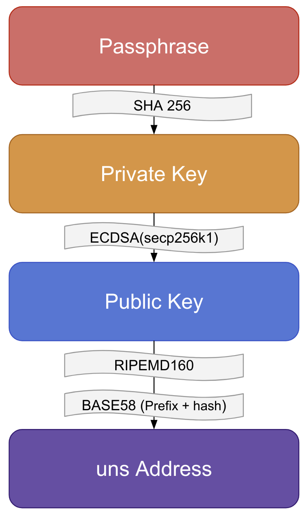

# uns.network DID Method Specification #


## Author ##

[Unikname Team](https://www.unikname.com/en/equipe-unikname-2/)

From [Space Elephant SAS/France](https://www.spacelephant.org/)

Written by [Sophie Dramé-Maigné](mailto:sophie.dramemaigne@unikname.com)


## Abstract ##

As the world is turning increasingly more digital, there is a growing need for globally unique identifiers. Decentralized Identifiers (DIDs) offer an alternative to traditional solutions relying on central entities to issue and manage such identifiers. DIDs take advantage of decentralized verifiable data registry such as blockchains to enable the decentralization of these processes and give users control over their own online identities. 

This document defines the `uns` DID method in compliance with the W3C's [DID Specification](https://w3c.github.io/did-core/). These DIDs identify the holders of **uns.network** accounts using their blockchain address. **uns.network** is a blockchain dedicated to the management of Non Fungible Tokens (NFT).

This document describes how uns-specific DID are generated as well as how to manage the corresponding DIDs and resolve them to DID Documents.

This DID method has been registered in the [DID Specification Registries](https://w3c.github.io/did-spec-registries/#did-methods).


## Intro ##

The `uns` DID method provides support for DIDs on the **uns.network** blockchain. More specifically, it associates a DID to every address in the ledger. This method is very minimalistic in the sense that it produces DID Document (DDoc) with minimal information: a DID and its associated public key. Furthermore, once a uns-did is created, it cannot be updated. 

The goal of this method is to work in tandem with other, more complex DID methods based on the same blockchain. **Uns.network** is dedicated to the management of Non Fungible Tokens (NFT). The first type of NFT that it supports is [@uniknames](https://docs.unikname.com/), human-readable identifiers. Just like any other tokens, @uniknames can be bought or exchanged, but they can also be linked to public properties the owner wishes to advertise, or used to connect to compliant websites in a private and secure fashion, among other things. The [`unik` DID method](https://github.com/spacelephant/did-method-spec) associates a DID to these NFT tokens, using uns-did as controllers.

Identifiers are only the first use case for **uns.network** NFTs. Other use cases are likely to require their own DID method based on `uns` DIDs.


## Target System ##

The `uns` DID method uses the [**uns.network**](docs.uns.network) blockchain as the underlying Verifiable Data Registry.

**uns.network** is a distributed network and protocol dedicated to handling IDs rooted in the blockchain, aiming to secure any web and mobile connections, and to protect users' privacy. 

**uns.network** is based on [ARK.io](https://ark.io).


## DID Method Name ##

This method is identified by the following string:  `uns`

A DID that uses this method MUST begin with the following prefix: `did:uns:`

The prefix MUST be in lowercase as per the [DID specification](https://www.w3.org/TR/did-core/#did-syntax). The format and generation of method-specific identifiers are defined below.


## Method-specific Identifier ##

This method uses **uns.network** addresses as identifiers. The DID identifies the holder of the private key associated with the address. A `uns` DID is formated as follows:

```
uns-did = "did:uns:" uns-specific-idstring
uns-specific-idstring = uns-address
uns-address =  34-character-long Base58 encoding of the public key
```

> :warning: **uns.network** addresses ARE case-sensitives.

**uns.network** address generation follows the generation pattern specified in [uns.network documentation](https://docs.uns.network/uns-network-key-concepts/cryptography-overview.html) as illustrated below:

|  |
| :----------------------------------------------------------: |
|                *Uns Address Generation Steps*                |


Different prefixes are used to identify different networks. **uns.network** uses the following prefixes:

| Network | dec  | hex  | Prefix | Example address                    |
| :------ | ---- | :--: | :----: | ---------------------------------- |
| Livenet | 68   | 0x44 |   U    | UYWaMkArHJjMecuHgs6LYapFtvV27QeafX |
| Sandbox | 63   | 0x3F |   S    | SMoCXZbMHTBLFtg15GnRYuFyUFk2gt44zb |


The uniqueness and security of a **uns.network** crypto-account (and therefore those of the associated DID) depend on the randomness of the associated passphrase. The cryptographic properties of the functions used to derive the address from the passphrase (ie. non reversibility and collusion resistance) and the security of the underlying elliptic curve (secp256k1) ensure that the private key cannot be recovered from the address or public key. But if the passphrase can be guessed, the crypto-account is compromised.


## Example uns DID Document (DDoc) ##

We provide an example DID Document below:

```json
{
    "@context": ["https://www.w3.org/ns/did/v1"],
    "id": "did:uns:UYWaMkArHJjMecuHgs6LYapFtvV27QeafX",
    "created": "2020-04-28T06:38:08Z",
    "verificationMethod": [
        {
            "id": "did:uns:UYWaMkArHJjMecuHgs6LYapFtvV27QeafX",
            "controller": "did:uns:UYWaMkArHJjMecuHgs6LYapFtvV27QeafX",
            "type": "EcdsaSecp256k1VerificationKey2019",
            "publicKeyHex": "02ef4ee8587a532cfb3bf3527c9ad1c14405cb1c6638ea477c5177dc121e35ea67"
        }
    ]
}
```


## CRUD Operation Definitions  ##

### Create (Register) ###

#### Step 1 - Private Key generation ####

The first step in creating a `uns` DID is to generate a **uns.network** address, which requires a passphrase that will be derived into a public/private key pair. 

> :warning: **The security of one's account is dependent on the associated passphrase randomness**: 
>
> One can technically use any word, phrase, or string as a passphrase which will result in a valid **uns.network** cryptoaccount; however, it is heavily discouraged as the security of an address relies on the randomness of its passphrase. Humans are bad at creating randomness, and entering sequences of random letters and numbers is not easy to do accurately.
>
> **uns.network** passphrases are implemented using ARK.IO algorithms, based on the [BIP39 Protocol](https://github.com/bitcoin/bips/blob/master/bip-0039.mediawiki), and are a combination of twelve words.


The creation of the private key is implicitly equivalent to the creation of the associated DID. This step can be achieved independently from the network.  

**uns.network** provides an interactive [Command Line Interface (CLI)](https://docs.uns.network/uns-use-the-network/cli.html) to create and manage cryptoaccounts. The following command can be used for account creation: 

```bash
$ uns cryptoaccount:create

» :warn: This information is not saved anywhere. You need to copy and save it by your own.;
{
  "address": "URLnkeNhceYPLUzX3ot29q3mfp11tXPKnU",
  "publicKey": "0286ad0c28b47fdf17870e3916f3badb97939a21d69cc03a524d490643e726c7b2",
  "privateKey": "4bb02985c61ceb74ae8dd4503018809ac43388bac385af1c9f4e901002935280",
  "passphrase": "cabin wedding recipe swear stuff churn twelve mammal sight shoulder ensure calm",
  "network": "livenet"
}

```

For more information, see the [relevant documentation](https://docs.uns.network/uns-use-the-network/cli.html#cryptoaccount-create).


#### Step 2: Address diclosure ####

**uns.network** addresses need not be registered with the network to be valid. However, if the **uns.network** blockchain has no record involving a given address, the associated DDoc cannot be generated. Therefore, to complete the DID creation process, the private key holder MUST perform an operation on **uns.network**.


### Read (Resolve) ###

The DDoc is constructed by extracting information written into the **uns.network** blockchain. These operations are read-only and are therefore not permissioned. 

The following [CLI](https://docs.uns.network/uns-use-the-network/cli.html#cryptoaccount-read) command can be used to read account information: 

```
$ uns cryptoaccount:read UYWaMkArHJjMecuHgs6LYapFtvV27QeafX

{
  "data": {
    "address": "UYWaMkArHJjMecuHgs6LYapFtvV27QeafX",
    "publicKey": "02ef4ee8587a532cfb3bf3527c9ad1c14405cb1c6638ea477c5177dc121e35ea67",
    "balance": 9.97,
    "token": "uns",
    "isDelegate": false,
    "nfts": {
      "unik": 1
    }
  }
```


The example output above constructs the following DDoc:

```json
{
    "@context": ["https://www.w3.org/ns/did/v1"],
    "id": "did:uns:UYWaMkArHJjMecuHgs6LYapFtvV27QeafX",
    "verificationMethod": [
        {
            "id": "did:uns:UYWaMkArHJjMecuHgs6LYapFtvV27QeafX#key1",
            "controller": "did:uns:UYWaMkArHJjMecuHgs6LYapFtvV27QeafX",
            "type": "EcdsaSecp256k1VerificationKey2019",
            "publicKeyHex": "02ef4ee8587a532cfb3bf3527c9ad1c14405cb1c6638ea477c5177dc121e35ea67"
        }
    ]
}
```


### Update ###

This function in not supported by the `uns` DID method.


### Delete (Deactivate) ###

This function in not supported by the `uns` DID method.


## Security Considerations ##

This section follows requirements from [RFC 3552](https://tools.ietf.org/html/rfc3552#section-5) and the [DID Core Specification](https://www.w3.org/TR/did-core/#security-requirements).


### CRUD Operations ###

Uns-specific DID and DDoc are created and read using the **uns.network** blockchain. All CRUD operations therefore benefit from the [security of **uns.network**](https://docs.uns.network/uns-network-security/) in terms of integrity protection and update authentication.


#### Integrity protection ####

The blockchain has many build-in integrity protection mechanisms. First, the history of transactions is replicated across many independent registries. Second, transactions and blocks are hashed and linked in a way that makes it impossible for a modification to go unnoticed. Third, **uns.network** is [secured by 23 players](https://docs.uns.network/uns-network-key-concepts/network-governance.html) that sign and validate blocks. Their number, diversity and vested interest in the network make it complicated to bribe them into forging an alternative history.

For all these reasons, once information has been added to the chain, it is hard to modify. Additionally, its integrity can easily be verified.


#### Authentication ####

The security of the authentication process is based on the assumption that the account owner is the only one that can access their private key. This assumption does not hold when the private key is derived from a "guessable" passphrase or if it has been otherwise compromised. The account owner is solely responsible for the security of their private key. To mitigate the first pitfall, user SHOULD choose random passphrases. We recommend to use a combination of twelve words generated using the [BIP39 Protocol](https://github.com/bitcoin/bips/blob/master/bip-0039.mediawiki). 

**uns.network** transaction are signed using ECDSA on the Secp256k1 curve. The security of ECDSA is dependent on the hardness of the Discrete Logarithm problem. Secp256k1 is a well-known and well-used curve. These choices ensure that a valid signature for a given public key can only be produced using the associated private key, which is only held by the account owner, thus authenticating the transaction and the associated operation. 


### Threat mitigation ###

#### Summary ####

| Attacks                  | In-scope ? | Susceptibility | Comments                                                     |
| ------------------------ | ---------- | -------------- | ------------------------------------------------------------ |
| Eavesdropping            | no         | out of scope   | because everything is public                                 |
| Replay attacks           | no         | out of scope   | because that will not affect the DID                         |
| Message Insertion        | yes        | Protected      | consequence: register a DID for someone else                 |
| Message Deletion         | yes        | Protected      | consequence: delete a DID                                    |
| Message Modification     | yes        | Protected      | consequence: take ownership of someone else's DID            |
| Man-in-the-middle attack | no         | out of scope   | because there is no communication stream to subvert          |
| Denial of service        | yes        | Mitigated      | on-chain mitigation: fees, out-of-chain attacks are out of scope |


#### In-scope attacks ####


##### Message insertion, deletion, and modification #####

###### Blockchain messages ######

On the blockchain, messages are transactions. To be valid, a transaction must be signed by the private key associated with the issuer's address. This means that issuers cannot be spoofed. The signature is applied to the whole transaction, so no modification can occur unless an attacker is able to forge a valid signature for the modified transaction. 

Once a transaction has been written into the blockchain, it is (computationally and logistically) very hard to delete (see CRUD operations - Integrity protection). In the event of an attacker intercepting a transaction before it reaches the network and censuring it, the issuer can re-issue said transaction using another network node. 

This assumes users use the verification mechanisms that are available to them (signatures, hashes, multiple sources, etc)


###### Out-of-blockchain messages ######

`uns` DID are written and read on the **uns.network** blockchain. Messages used to request, transfer or otherwise manage this information are implementation-dependent. Their security is considered out of scope.


##### Denial of service (DoS) #####

###### On the blockchain ######

Every **uns.network** transaction requires a fee to be processed. These fees are dependent on a transaction's volume and type. The network mitigates Denial of Service attacks by imposing a cost to each attempt that scales with the attack.

Additionally, **uns.network** ensures there is a diversity of emitters in any given block. This prevents a single source from flooding the network with bogus transactions.


###### On a given node ######

Network players that choose to run their own blockchain node are solely responsible for their security. This includes a susceptibility to DoS attacks. If a given node cannot be contacted however, users can address their request to any other node on the network. Setting up a **uns.network** node is easy, the main hurdle being the time required to synchronize the new node to the network. As such, in the event of a large DoS attack, new network nodes can be deployed to replace those that cannot be accessed.


#### Out of scope attacks ####

All records from **uns.network** are public. An eavesdropper would gain no additional knowledge from what is already publicly available. This attack is therefore considered out of scope.

This method does not support the update operation. Any valid blockchain transaction can be used to create a `uns` DID. Replaying an existing transaction would not affect existing transactions, nor could it update the associated DID or DDoc. This attack is therefore considered out of scope.

Information used to create `uns` DID and DDoc are independently verifiable irregardless of how they were obtained. This means that an attacker gains nothing from subverting the communication channel used to retrieve them. This attack is therefore considered out of scope.


## Privacy Considerations ##

Information about DID and privacy can be found in the [DID Core Specification](https://www.w3.org/TR/did-core/#privacy-considerations).

## References ##

[ECDSA Secp256k1 Signature 2019](https://w3c-ccg.github.io/lds-ecdsa-secp256k1-2019/). O. Steele. W3C. April 2019

[Linked Data Proofs](https://w3c-ccg.github.io/ld-proofs/). D. Longley, M. Sporny. W3C. 